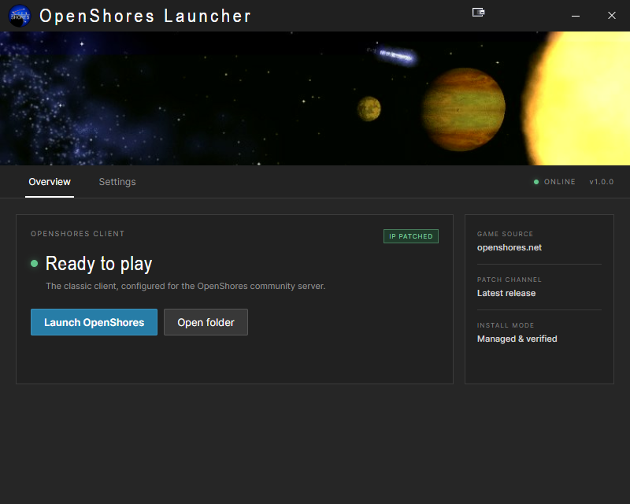

# OpenShores Launcher


A fast, portable Windows launcher for [OpenShores](https://openshores.net/), built with Tauri. It downloads the official game client, applies the latest compatible [OpenShores IP Patch](https://github.com/Celarious/OpenShores-IP-Patch), launches the game, and manages updates and uninstallation from a compact native interface.

## Features

- Downloads and installs the official OpenShores client.
- Fetches and applies the latest compatible IP patch with xdelta3.
- Launches the game and keeps the installed state after the game exits.
- Refreshes or removes the launcher-managed game installation.
- Checks the game, patch, and launcher update channels independently.
- Updates the portable launcher executable in place—no installer required.
- Stores settings and working data under `%LOCALAPPDATA%\OpenShores-Launcher`.
- Defaults the game installation to `%LOCALAPPDATA%\OpenShores`.

## Using the launcher

### Requirements

- Windows 10 or Windows 11, 64-bit.
- Microsoft Edge WebView2 Runtime. It is included with current Windows releases and does not normally need to be installed separately.
- An internet connection for game installation and update checks.

### Run it

1. Download `OpenShores-Launcher.exe` from the repository's **Releases** page.
2. Move the executable to a permanent, user-writable location, such as a folder under Documents or `%LOCALAPPDATA%`. Avoid `Program Files`, because the portable self-updater must be able to replace the executable. (Optional)
3. Double-click the executable. No installation required.
4. Select **Install OpenShores**. The launcher downloads the official client, extracts it, downloads the latest IP patch, and applies it automatically.
5. Select **Launch OpenShores** when the status changes to **Ready to play**.

The game installation folder can be changed from **Settings** before installation. Errors displayed by the launcher can be selected and copied when reporting a problem.

### Files created by the launcher

The portable executable remains wherever you placed it. Launcher-specific data is stored separately:

| Location | Purpose |
| --- | --- |
| `%LOCALAPPDATA%\OpenShores-Launcher\config.json` | Launcher settings and the configured game path |
| `%LOCALAPPDATA%\OpenShores-Launcher\temp` | Downloads, update files, and temporary replacement scripts |
| `%LOCALAPPDATA%\OpenShores-Launcher\webview` | WebView2 application data |
| `%LOCALAPPDATA%\OpenShores` | Default managed game installation |

Selecting **Uninstall OpenShores** removes the managed game installation, not the launcher itself. To remove the launcher completely, close it, delete its portable `.exe`, and optionally delete `%LOCALAPPDATA%\OpenShores-Launcher` if you also want to remove its settings and cached data.

## Screenshots


## Contributing

Contributions and issue reports are welcome. Development currently targets 64-bit Windows.

### Development requirements

Install the following before cloning the project:

- [Git for Windows](https://git-scm.com/download/win)
- [Node.js](https://nodejs.org/) with npm
- The stable [Rust MSVC toolchain](https://www.rust-lang.org/tools/install)
- Microsoft Visual Studio Build Tools with the **Desktop development with C++** workload
- Microsoft Edge WebView2 Runtime

### Clone and run

```powershell
git clone https://github.com/Norway174/OpenShores-Launcher.git
cd OpenShores-Launcher
npm install
npm start
```

`npm start` compiles the Rust backend in development mode and launches the Tauri application. The frontend has no JavaScript package dependencies; npm is used as a convenient entry point for the PowerShell build scripts.

### Test and build

```powershell
npm test
npm run dist
```

`npm test` runs the Rust test suite. `npm run dist` creates the optimized portable executable at:

```text
dist\OpenShores-Launcher.exe
```

`package.json` is the source of truth for the launcher version. The build and test scripts synchronize that version into the Rust and Tauri metadata. A push to `main` only creates a GitHub release when that version does not already have a matching tag; ordinary commits run without publishing a release. A five-minute scheduled check recovers automatically if GitHub suppresses or misses a push event.

To publish a new launcher, update the version in `package.json`, commit it with the release changes, and push to `main`. GitHub Actions builds the Windows executable, creates a matching `v<version>` release, and uploads both the portable executable and its SHA-256 checksum.

The release executable uses the static MSVC C runtime and embeds the frontend, application icon, and xdelta3 utility. Windows supplies WebView2, which keeps the portable binary substantially smaller than an Electron bundle.

### Project layout

| Path | Purpose |
| --- | --- |
| `src-tauri/src/main.rs` | Native launcher backend, downloads, patching, process management, and updates |
| `src/renderer` | HTML, CSS, JavaScript, and runtime image assets embedded by Tauri |
| `src-tauri/tauri.conf.json` | Tauri application and security configuration |
| `resources/xdelta3` | Embedded xdelta3 executable and its GPLv2 license |
| `scripts` | Development, test, and portable release build scripts |
| `assets` | Source artwork and design exports |
| `build/icon.ico` | Windows executable icon used by the release build |

Do not commit `src-tauri/target`, `src-tauri/gen`, `dist`, or `node_modules`; these are generated locally and excluded by `.gitignore`.

## Downloads, updates, and licensing

- Game client: [openshores.net/downloads/OpenShores.zip](https://openshores.net/downloads/OpenShores.zip)
- IP patch releases: [Celarious/OpenShores-IP-Patch](https://github.com/Celarious/OpenShores-IP-Patch)
- Launcher updates: releases from `Norway174/OpenShores-Launcher`

Binary patch application uses the embedded xdelta3 3.0.11 executable. xdelta3 is distributed under GPLv2, and its license is included at `resources/xdelta3/COPYING`.

## Disclaimer

This launcher was vibe-coded with AI. Although it has been reviewed and tested, AI-assisted code can contain mistakes; use it at your own risk and review contributions carefully.
